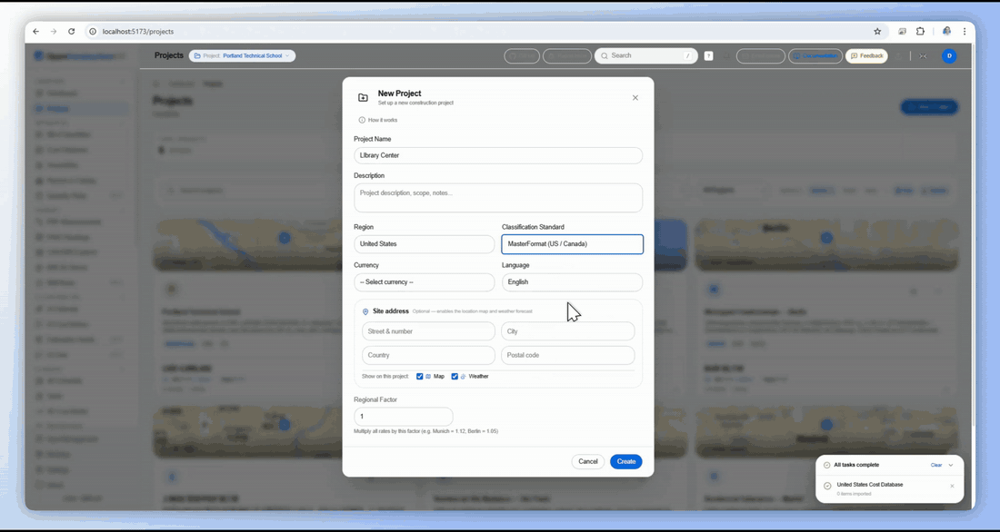
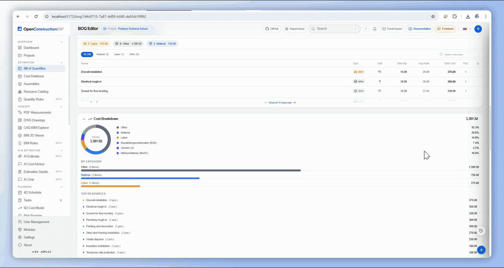
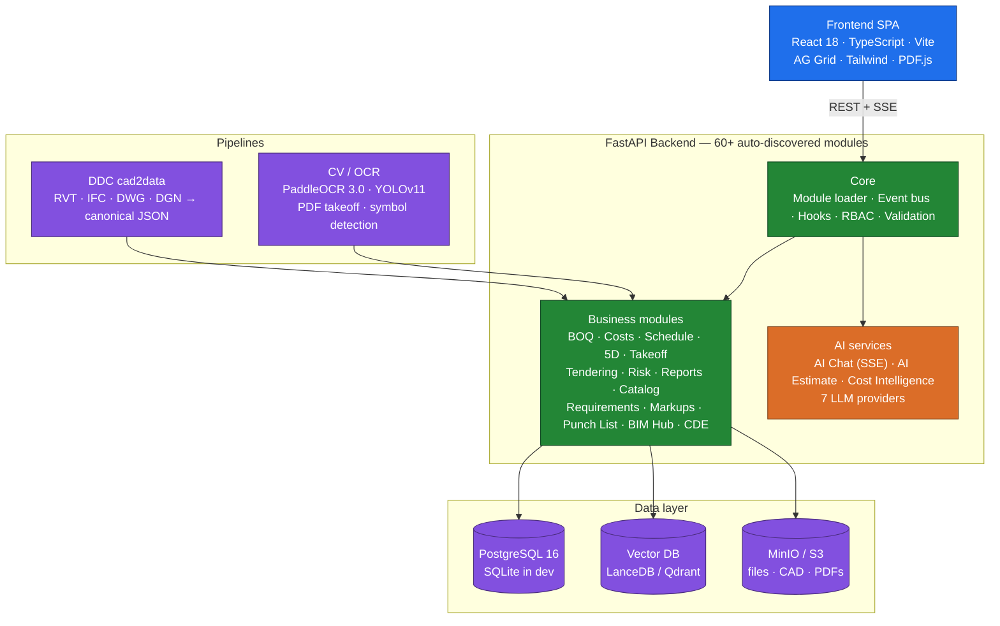

<div align="center">

# OpenConstructionERP

**The #1 Open-Source Construction Estimation & Project Management Software**

Professional BOQ, 4D/5D planning, AI-powered estimation, CAD/BIM takeoff — all in one platform.

[Demo](https://openconstructionerp.com) · [Documentation](https://openconstructionerp.com/docs) · [Discussions](https://t.me/datadrivenconstruction) · [Report Bug](https://github.com/datadrivenconstruction/OpenConstructionERP/issues)

[](LICENSE)
[](https://github.com/datadrivenconstruction/OpenConstructionERP/releases/tag/v2.1.0)
[](https://pypi.org/project/openconstructionerp/)
[](https://pepy.tech/project/openconstructionerp)
[](https://github.com/datadrivenconstruction/OpenConstructionERP/stargazers)
[](https://github.com/datadrivenconstruction/OpenConstructionERP/commits/main)
[](https://github.com/datadrivenconstruction/OpenConstructionERP/issues)


*100% open source · 55,000+ cost items · AI estimation · 21 languages · Self-hosted*

</div>

---

<details open style="width: 100%">
<summary><h2>Table of Contents</h2></summary>

<table style="width: 100%; table-layout: fixed;">
<tr>
<td width="33%" valign="top">

**Getting Started**
- [Why OpenConstructionERP?](#why-openconstructionerp)
- [See It In Action](#see-it-in-action)
- [Quick Start](#quick-start)
- [Demo Accounts](#demo-accounts)

</td>
<td width="33%" valign="top">

**Core Modules**
- [BOQ Management](#-bill-of-quantities-boq-management)
- [Cost Databases & Catalog](#%EF%B8%8F-cost-databases--resource-catalog)
- [CAD/BIM & AI Estimation](#%EF%B8%8F-cadbim-takeoff--ai-estimation)

</td>
<td width="33%" valign="top">

**Planning & Delivery**
- [4D Scheduling & 5D Cost](#-4d-scheduling--5d-cost-model)
- [Tendering, Risk & Reports](#-tendering-risk--reporting)
- [Requirements & Quality](#-requirements--quality-gates)

</td>
</tr>
<tr>
<td valign="top">

**Field Tools**
- [PDF Markups & Annotations](#%EF%B8%8F-pdf-markups--annotations)
- [Punch List](#-punch-list)
- [Validation Engine](#%EF%B8%8F-validation--compliance-engine)

</td>
<td valign="top">

**Standards & Onboarding**
- [20 Regional Standards](#-20-regional-standards)
- [Guided Onboarding](#-guided-onboarding)
- [Key Features Overview](#key-features)

</td>
<td valign="top">

**Technical**
- [Tech Stack](#tech-stack)
- [Architecture](#architecture)
- [Security](#security)

</td>
</tr>
<tr>
<td valign="top">

**Project & Community**
- [Support the Project](#support-the-project)

</td>
<td valign="top">

**Compliance**
- [AI Disclaimer](#ai-disclaimer)
- [Trademarks](#trademarks)
- [Export Control](#export-control)

</td>
<td valign="top">

**Legal & Privacy**
- [Star History](#star-history)
- [License](#license)
- [Privacy and Terms](#privacy-and-terms)

</td>
</tr>
</table>

</details>

---

## ✨ What's New in v2.0.0

The second stable release — shipped **April 20, 2026**. Supersedes the entire 1.x line.

<table>
<tr>
<td width="50%" valign="top">

**🔧 Reliability**
- AI Chat SSE streams survive middleware cancellation
- AI API keys survive backend restarts (absolute-path `.env` loading, Fernet decryption gating)
- DWG Takeoff respects DXF `$INSUNITS` end-to-end
- BIM Linked-BOQ panel populates via new aggregate endpoint
- 48 backend integration tests fixed — 61/61 green

**🧩 Module Developer Experience**
- `MODULES.md` at repo root — single entry point
- New in-app `/modules/developer-guide` page
- **"+ Add module"** CTA in the sidebar
- Covers backend Python + frontend React scaffolding

</td>
<td width="50%" valign="top">

**📊 CAD-BIM BI Explorer**
- Renamed from *CAD-BIM Explorer*
- KPI strip: Elements · Volume · Area · Length · Weight · Categories · Levels
- Power-BI-style data bars in pivot cells
- Slicers, saved views, drill-down from charts

**✨ UX Polish**
- Dashboard: Quick Start is now pure-navigation, explicit *New Estimate* button, Quality Score icon + click-through
- About page: Artem Boiko avatar, DDC logo, full-width clickable book banner, LinkedIn / Telegram / X community block
- Layered DDC provenance watermarks for copyright enforcement

</td>
</tr>
</table>

See the [full v2.0.0 changelog](CHANGELOG.md#200--2026-04-20) or the [v2.0.0 GitHub release](https://github.com/datadrivenconstruction/OpenConstructionERP/releases/tag/v2.0.0).

---

## Why OpenConstructionERP?

Construction cost estimation software is expensive, closed-source, and locked to specific regions. OpenConstructionERP changes that.

| What you get | How it works |
|-------------|-------------|
| **Free forever** | AGPL-3.0 license. No subscriptions, no per-seat fees, no vendor lock-in. |
| **Your data, your server** | Self-hosted. Everything runs on your machine — nothing leaves your network. |
| **21 languages** | Full UI translation: English, German, French, Spanish, Portuguese, Russian, Chinese, Arabic, Hindi, Japanese, Korean, and 10 more. |
| **20 regional standards** | DIN 276, NRM 1/2, CSI MasterFormat, GAEB, ГЭСН, DPGF, GB/T 50500, CPWD, and more. |
| **AI-powered** | Connect any LLM provider (Anthropic, OpenAI, Gemini, Mistral, Groq, DeepSeek) for smart estimation. |
| **55,000+ cost items** | CWICR database with 11 regional pricing databases (DACH, UK, US, France, Spain, Brazil, Russia, UAE, China, India, Canada). |

### How It Compares

<table>
<tr>
<th align="left">Capability</th>
<th align="center">OpenConstructionERP</th>
<th align="center">RIB iTWO</th>
<th align="center">Exactal CostX</th>
<th align="center">Sage Estimating</th>
<th align="center">Bluebeam</th>
</tr>
<tr><td><b>License</b></td><td align="center">AGPL-3.0 (free)</td><td align="center">Proprietary</td><td align="center">Proprietary</td><td align="center">Proprietary</td><td align="center">Proprietary</td></tr>
<tr><td><b>Self-hosted / offline</b></td><td align="center">&#10004;</td><td align="center">&#10006;</td><td align="center">&#10006;</td><td align="center">&#9888; partial</td><td align="center">&#10006;</td></tr>
<tr><td><b>Price</b></td><td align="center"><b>Free forever</b></td><td align="center">~&#8364;500/mo</td><td align="center">~&#8364;300/mo</td><td align="center">~&#8364;200/mo</td><td align="center">~&#8364;30/mo</td></tr>
<tr><td><b>AI estimation</b></td><td align="center">&#10004; 7 LLM providers</td><td align="center">&#10006;</td><td align="center">&#10006;</td><td align="center">&#10006;</td><td align="center">&#10006;</td></tr>
<tr><td><b>UI languages</b></td><td align="center"><b>21</b></td><td align="center">5</td><td align="center">3</td><td align="center">2</td><td align="center">8</td></tr>
<tr><td><b>Regional standards</b></td><td align="center"><b>20</b></td><td align="center">4</td><td align="center">3</td><td align="center">2</td><td align="center">&mdash;</td></tr>
<tr><td><b>BOQ editor</b></td><td align="center">&#10004;</td><td align="center">&#10004;</td><td align="center">&#10004;</td><td align="center">&#10004;</td><td align="center">&#10006;</td></tr>
<tr><td><b>CAD/BIM takeoff</b></td><td align="center">&#10004; RVT IFC DWG DGN</td><td align="center">&#10004;</td><td align="center">&#10004;</td><td align="center">&#10006;</td><td align="center">&#10004; PDF only</td></tr>
<tr><td><b>4D/5D planning</b></td><td align="center">&#10004;</td><td align="center">&#10004;</td><td align="center">&#10006;</td><td align="center">&#10006;</td><td align="center">&#10006;</td></tr>
<tr><td><b>Cost database included</b></td><td align="center">&#10004; 55K+ items with rates</td><td align="center">&#10006; extra cost</td><td align="center">&#10006; extra cost</td><td align="center">&#10006; extra cost</td><td align="center">&#10006;</td></tr>
<tr><td><b>Resource catalog</b></td><td align="center">&#10004; 7K+ with prices</td><td align="center">&#10006; extra cost</td><td align="center">&#10006;</td><td align="center">&#10006;</td><td align="center">&#10006;</td></tr>
<tr><td><b>Validation engine</b></td><td align="center">&#10004; 42 rules</td><td align="center">&#9888; limited</td><td align="center">&#10006;</td><td align="center">&#10006;</td><td align="center">&#10006;</td></tr>
<tr><td><b>REST API</b></td><td align="center">&#10004; full access</td><td align="center">&#9888; limited</td><td align="center">&#10006;</td><td align="center">&#10006;</td><td align="center">&#10006;</td></tr>
<tr><td><b>Real-time collaboration</b></td><td align="center">&#10004; soft locks + presence</td><td align="center">&#10004;</td><td align="center">&#10006;</td><td align="center">&#10006;</td><td align="center">&#10006;</td></tr>
<tr><td><b>Open data export</b></td><td align="center">&#10004; GAEB, Excel, CSV, JSON, PDF</td><td align="center">&#9888; limited</td><td align="center">&#9888; limited</td><td align="center">&#9888; limited</td><td align="center">PDF only</td></tr>
<tr><td><b>BIM requirements (IDS/COBie)</b></td><td align="center">&#10004; import + export</td><td align="center">&#10006;</td><td align="center">&#10006;</td><td align="center">&#10006;</td><td align="center">&#10006;</td></tr>
</table>

<sub>Product names are trademarks of their respective owners. This comparison is based on publicly available information as of Q1 2026. Pricing is approximate (per-seat, list price) and may vary by region. OpenConstructionERP is not affiliated with any of the listed vendors.</sub>

---

## See It In Action

### Core workflows

<table>
<tr>
<td align="center" width="50%">
<strong>🎬 Full Workflow</strong><br/>
<em>From upload to estimate — complete demo</em><br/><br/>

</td>
<td align="center" width="50%">
<strong>📸 AI Photo → Estimate</strong><br/>
<em>Upload a construction photo, get a BOQ in seconds</em><br/><br/>

</td>
</tr>
<tr>
<td align="center">
<strong>🏗️ BIM → BOQ Takeoff</strong><br/>
<em>Import IFC/RVT, auto-extract quantities to BOQ</em><br/><br/>

</td>
<td align="center">
<strong>📐 PDF Takeoff</strong><br/>
<em>Measure directly on PDF drawings</em><br/><br/>

</td>
</tr>
<tr>
<td align="center">
<strong>🔍 55K+ Cost Items</strong><br/>
<em>Find any cost item across 11 regional databases</em><br/><br/>

</td>
<td align="center">
<strong>⚡ Build BOQ in 60 Seconds</strong><br/>
<em>Keyboard-first editor with inline cost lookup</em><br/><br/>

</td>
</tr>
</table>

### Module deep-dives

<table>
<tr>
<td align="center" width="50%">
<strong>👤 Role-Based Setup</strong><br/>
<em>Onboarding wizard pre-selects the right 17 of 46 modules for your role</em><br/><br/>

</td>
<td align="center" width="50%">
<strong>🌍 Multi-Region Project</strong><br/>
<em>Any region, any standard, any currency — live map & weather built-in</em><br/><br/>

</td>
</tr>
<tr>
<td align="center">
<strong>🏗️ Bulk BIM Quantities</strong><br/>
<em>Link 100 walls → one BOQ line with aggregated area / volume / length</em><br/><br/>

</td>
<td align="center">
<strong>📐 DWG Layer Control</strong><br/>
<em>636 wall entities across 10 layers — every one linkable to the BOQ</em><br/><br/>

</td>
</tr>
<tr>
<td align="center">
<strong>💵 $6.26M in 215 Positions</strong><br/>
<em>Real Revit project → 88 sections, CWICR-priced, quality score 99</em><br/><br/>

</td>
<td align="center">
<strong>✅ BIM-Linked Tasks</strong><br/>
<em>Issues tied to exact model elements, tracked on a Kanban board</em><br/><br/>

</td>
</tr>
<tr>
<td align="center">
<strong>📊 Pivot → BOQ</strong><br/>
<em>CAD-BIM Explorer pivot becomes 10 BOQ positions in one click</em><br/><br/>

</td>
<td align="center">
<strong>🗺️ Global Portfolio</strong><br/>
<em>7 projects, 4 continents, $28.3M in active estimates — one workspace</em><br/><br/>

</td>
</tr>
</table>

---

### Complete Estimation Workflow

OpenConstructionERP covers the full lifecycle — from first sketch to final tender submission:

```
  Upload              Convert            Validate           Estimate           Tender
 ┌────────┐        ┌──────────┐       ┌───────────┐      ┌──────────┐      ┌──────────┐
 │PDF/CAD │───────▶│ Extract  │──────▶│ 42 rules  │─────▶│BOQ Editor│─────▶│ Bid Pkgs │
 │Photo   │        │quantities│       │ DIN/NRM/  │      │ + AI     │      │ Compare  │
 │Text    │        │ + AI     │       │ MasterFmt │      │ + Costs  │      │ Award    │
 └────────┘        └──────────┘       └───────────┘      └──────────┘      └──────────┘
                                                               │
                                                         ┌─────┴──────┐
                                                         │ 4D Schedule│
                                                         │ 5D Costs   │
                                                         │ Risk Reg.  │
                                                         │ Reports    │
                                                         └────────────┘
```

---

⭐ <b>If you want to see new updates and database versions and if you find our tools useful please give our repositories a star to see more similar applications for the construction industry.</b>
Star OpenConstructionERP on GitHub and be instantly notified of new releases.
<p align="center">
  <br>
  
  <br></br>
</p>

---

## Key Features

### 📊 Bill of Quantities (BOQ) Management


Build professional cost estimates with a powerful BOQ editor:

- **Hierarchical BOQ structure** — Sections, positions, sub-positions with drag-and-drop reordering
- **Inline editing** — Click any cell to edit. Tab between fields. Undo/redo with Ctrl+Z
- **Resources & assemblies** — Link labor, materials, equipment to each position. Build reusable cost recipes
- **Markups** — Overhead, profit, VAT, contingency — configure per project or use regional defaults
- **Automatic calculations** — Quantity × unit rate = total. Section subtotals. Grand total with markups
- **Validation** — 42 built-in rules check for missing quantities, zero prices, duplicate items, and compliance with DIN 276, NRM, MasterFormat
- **Export** — Download as Excel, CSV, PDF report, or GAEB XML (X83)

### 🗄️ Cost Databases & Resource Catalog


Access the world's construction pricing data:

- **CWICR database** — 55,000+ cost items covering all major construction trades. Available in 9 languages with 11 regional price sets
- **Smart search** — Find items by description, code, or classification. AI-powered semantic search matches meaning, not just keywords ("concrete wall" finds "reinforced partition C30/37")
- **Resource catalog** — 7,000+ materials, equipment, labor rates, and operators. Build custom assemblies from catalog items
- **Regional pricing** — Automatic price adjustment based on project location. Compare rates across regions
- **Import your data** — Upload your own cost database from Excel, CSV, or connect via API

### 🏗️ CAD/BIM Takeoff & AI Estimation


Extract quantities from any source — drawings, models, text, or photos:

- **CAD/BIM takeoff** — Upload Revit (.rvt), IFC, AutoCAD (.dwg), or MicroStation (.dgn) files. DDC converters extract elements with volumes, areas, and lengths automatically
- **Interactive QTO** — Choose how to group extracted data: by Category, Type, Level, Family. Format-specific presets for Revit and IFC
- **Linked geometry preview** — Click the BIM link badge on any BOQ position to see a 3D preview of linked elements with interactive rotate/zoom/pan controls
- **BIM Quantity Picker** — Select quantities (area, volume, length) directly from linked BIM elements and apply them to BOQ positions. The source parameter name is shown next to the unit
- **DWG polyline measurement** — Click any polyline in the DWG viewer to instantly see area, perimeter, and individual segment lengths with on-canvas labels
- **PDF measurement** — Open construction drawings directly in the browser. Measure distances, areas, and count elements with calibrated scale
- **AI estimation** — Describe your project in plain text, upload a building photo, or paste a PDF — AI generates a complete BOQ with quantities and market rates
- **AI Cost Advisor** — Ask questions about pricing, materials, or estimation methodology. AI answers using your cost database as context
- **Cost matching** — After AI generates an estimate, match each item against your CWICR database to replace AI-guessed rates with real market prices

### 📅 4D Scheduling & 5D Cost Model

Plan your project timeline and track costs over time:

- **Gantt chart** — Visual project schedule with drag-and-drop activities, dependencies (FS/FF/SS/SF), and critical path highlighting
- **Auto-generate from BOQ** — Create schedule activities directly from your BOQ sections with cost-proportional durations
- **Earned Value Management** — Track SPI, CPI, EAC, and variance. S-curve visualization shows planned vs actual progress
- **Budget tracking** — Set baselines, compare snapshots, run what-if scenarios
- **Monte Carlo simulation** — Risk-adjusted schedule analysis with probability distributions

### 📋 Tendering, Risk & Reporting

Complete your estimation workflow:

- **Tendering** — Create bid packages, distribute to subcontractors, collect and compare bids with side-by-side price mirror
- **Change orders** — Track scope changes with cost and schedule impact analysis
- **Risk register** — Probability × impact matrix, mitigation strategies, risk-adjusted contingency
- **Reports** — Generate professional PDF reports, Excel exports, GAEB XML. 12 built-in templates
- **Documents** — Centralized file management with version tracking and drag-and-drop upload

### 📝 Requirements & Quality Gates

Track and validate construction requirements with the EAC (Entity-Attribute-Constraint) system:

- **EAC Triplets** — Capture requirements as structured data: Entity (wall), Attribute (fire_rating), Constraint (≥ F90)
- **4 Quality Gates** — Completeness → Consistency → Coverage → Compliance. Run sequentially to validate requirements
- **BOQ Traceability** — Link each requirement to BOQ positions for full traceability from spec to estimate
- **Bulk Import** — Import requirements from structured text (pipe-delimited format)
- **Categories** — Structural, fire safety, thermal, acoustic, waterproofing, electrical, mechanical, architectural

### ✏️ PDF Markups & Annotations

Annotate construction drawings and documents directly in the browser:

- **10 markup types** — Cloud, arrow, text, rectangle, highlight, polygon, distance, area, count, stamp
- **Custom stamps** — Approved, Rejected, For Review, Revised, Final + create your own with logo and date
- **Scale calibration** — Set real-world scale per page for accurate measurements
- **Markups List** — Table view of all annotations with filters, search, and CSV export
- **BOQ Integration** — Link measurements directly to BOQ positions (quantity = measured value)

### ✅ Punch List

Track construction deficiencies from discovery to resolution:

- **5-stage workflow** — Open → In Progress → Resolved → Verified → Closed
- **Location pins** — Mark exact position on PDF drawings (x/y coordinates)
- **Priority levels** — Low, Medium, High, Critical with color coding
- **Photo attachments** — Upload photos of deficiencies from the field
- **Categories** — Structural, mechanical, electrical, architectural, fire safety, plumbing, finishing
- **PDF Export** — Generate punch list reports for stakeholder review
- **Verification control** — Different user must verify (not the resolver)

### 🌍 20 Regional Standards

| Standard | Region | Format |
|----------|--------|--------|
| DIN 276 / ÖNORM / SIA | Germany / Austria / Switzerland | Excel, CSV |
| NRM 1/2 (RICS) | United Kingdom | Excel, CSV |
| CSI MasterFormat | United States / Canada | Excel, CSV |
| GAEB DA XML 3.3 | DACH region | XML |
| DPGF / DQE | France | Excel, CSV |
| ГЭСН / ФЕР | Russia / CIS | Excel, CSV |
| GB/T 50500 | China | Excel, CSV |
| CPWD / IS 1200 | India | Excel, CSV |
| Bayındırlık Birim Fiyat | Turkey | Excel, CSV |
| 積算基準 (Sekisan) | Japan | Excel, CSV |
| Computo Metrico / DEI | Italy | Excel, CSV |
| STABU / RAW | Netherlands | Excel, CSV |
| KNR / KNNR | Poland | Excel, CSV |
| 표준품셈 | South Korea | Excel, CSV |
| NS 3420 / AMA | Nordic countries | Excel, CSV |
| ÚRS / TSKP | Czech Republic / Slovakia | Excel, CSV |
| ACMM / ANZSMM | Australia / New Zealand | Excel, CSV |
| CSI / CIQS | Canada | Excel, CSV |
| FIDIC | UAE / GCC | Excel, CSV |
| PBC / Base de Precios | Spain | Excel, CSV |

### 🛡️ Validation & Compliance Engine

Ensure your estimates meet regulatory standards before submission:

- **42 built-in rules** across 13 rule sets — DIN 276, NRM, MasterFormat, GAEB, and universal BOQ quality checks
- **Real-time validation** — Run checks with Ctrl+Shift+V. Each position gets a pass/warning/error indicator
- **Quality score** — Overall BOQ quality percentage (0–100%) visible in the toolbar
- **Drill-down** — Click any finding to jump directly to the affected BOQ position and fix it
- **Custom rules** — Define project-specific validation rules via the rule builder or Python scripting

### 🚀 Guided Onboarding

Get productive in under 10 minutes:

1. **Choose language** — Select from 21 languages. The entire UI switches instantly
2. **Select region** — Determines default cost database, currency, and classification standard
3. **Load cost database** — One-click import of CWICR pricing data for your region (55,000+ items)
4. **Import resource catalog** — Materials, labor, equipment, and pre-built assemblies
5. **Configure AI** *(optional)* — Enter an API key from any supported LLM provider
6. **Create your first project** — Set name, region, standard, and start estimating

---

## Quick Start

### Fastest: One-Line Install

```bash
# Linux / macOS
curl -sSL https://raw.githubusercontent.com/datadrivenconstruction/OpenConstructionERP/main/scripts/install.sh | bash

# Windows (PowerShell)
irm https://raw.githubusercontent.com/datadrivenconstruction/OpenConstructionERP/main/scripts/install.ps1 | iex
```

Auto-detects Docker / Python / uv → installs and runs at **http://localhost:8080**

### Option 1: Docker (recommended)

```bash
git clone https://github.com/datadrivenconstruction/OpenConstructionERP.git
cd OpenConstructionERP
make quickstart
```

Open **http://localhost:8080** — builds everything in ~2 minutes.

### Option 2: Local Development (no Docker)

```bash
git clone https://github.com/datadrivenconstruction/OpenConstructionERP.git
cd OpenConstructionERP

# Install dependencies
cd backend && pip install -r requirements.txt && cd ..
cd frontend && npm install && cd ..

# Start (Linux/macOS)
make dev

# Start (Windows — two terminals)
# Terminal 1: cd backend && uvicorn app.main:create_app --factory --reload --port 8000
# Terminal 2: cd frontend && npm run dev
```

Open **http://localhost:5173** — requires Python 3.12+ and Node.js 20+. Uses SQLite by default — zero configuration needed.

### Option 3: pip install (full app — backend + frontend)

```bash
pip install openconstructionerp
openconstructionerp serve --open
```

One command installs everything. Opens browser at **http://localhost:8080** with full UI. Uses SQLite — zero config. [PyPI package](https://pypi.org/project/openconstructionerp/) (2.6 MB, includes pre-built frontend).

### Demo Accounts

Three demo accounts are created automatically on first start:

| Account | Email | Password | Role |
|---------|-------|----------|------|
| Admin | `demo@openestimator.io` | `DemoPass1234!` | Full access |
| Estimator | `estimator@openestimator.io` | `DemoPass1234!` | Estimator |
| Manager | `manager@openestimator.io` | `DemoPass1234!` | Manager |

> Demo accounts include 5 pre-loaded projects from Berlin, London, New York, Paris, and Dubai with complete BOQs, schedules, and cost models.

---

## Tech Stack

| Layer | Technology | Purpose |
|-------|-----------|---------|
| Backend | Python 3.12+ / FastAPI | Async API, Pydantic v2 validation, modular architecture |
| Frontend | React 18 / TypeScript / Vite | SPA with code splitting, 21 language bundles |
| Database | PostgreSQL 16+ / SQLite (dev) | OLTP with JSON columns, zero-config SQLite for development |
| UI | Tailwind CSS / AG Grid | Professional data grid, responsive design, dark mode |
| AI | Any LLM via REST API | Anthropic, OpenAI, Gemini, Mistral, Groq, DeepSeek |
| Vector Search | LanceDB (embedded) / Qdrant | Semantic cost item search, 384d or 3072d embeddings |
| CAD/BIM | [DDC cad2data](https://github.com/datadrivenconstruction) | RVT, IFC, DWG, DGN → structured quantities |
| i18n | i18next + 21 language packs | Full RTL support (Arabic), locale-aware formatting |

## Architecture



<details>
<summary>Plain-text version (for screen readers or non-Mermaid renderers)</summary>

```
┌──────────────────────────────────────────────────┐
│  Frontend (React SPA)                            │
│  TypeScript · Tailwind · AG Grid · PDF.js        │
└──────────────────┬───────────────────────────────┘
                   │ REST + SSE
┌──────────────────┴───────────────────────────────┐
│  Backend (FastAPI)                               │
│  60+ auto-discovered modules · Plugin system     │
├──────────────────────────────────────────────────┤
│  BOQ · Costs · Schedule · 5D · Validation · AI   │
│  Takeoff · Tendering · Risk · Reports · Catalog  │
│  Requirements · Markups · Punch List · BIM Hub   │
├──────────────────────────────────────────────────┤
│  Database (PostgreSQL / SQLite)                  │
│  Vector DB (LanceDB / Qdrant)                    │
│  CAD Converters (DDC cad2data)                   │
│  CV Pipeline (PaddleOCR + YOLOv11)               │
└──────────────────────────────────────────────────┘
```

</details>

---

## Support the Project

OpenConstructionERP is built and maintained by the community. If you find it useful:

- ⭐ **[Star this repo](https://github.com/datadrivenconstruction/OpenConstructionERP)** — helps others discover the project
- 💬 **[Join Discussions](https://t.me/datadrivenconstruction)** — ask questions, share ideas, help others
- 🐛 **[Report issues](https://github.com/datadrivenconstruction/OpenConstructionERP/issues)** — help us improve
- 💼 **[Professional consulting](https://datadrivenconstruction.io/contact-support/)** — custom deployment, training, enterprise support

## Security

OpenConstructionERP includes security hardening for production deployments:
- Path traversal protection on all file download endpoints
- CORS wildcard blocking in production mode
- Bounded input validation on bulk price operations
- Generic error responses to prevent account enumeration
- Production startup checks for secrets, credentials, and database configuration

Report vulnerabilities via [GitHub Issues](https://github.com/datadrivenconstruction/OpenConstructionERP/issues) (private reports supported).

## AI disclaimer

AI suggestions produced by this software are preliminary estimates. A
qualified construction-estimation professional must verify all
quantities, classifications, and costs before any contractual or
tender-submission use. See [NOTICE](NOTICE) and [TERMS.md](TERMS.md) §4.

## Trademarks

All product names, logos, and trademarks referenced in this repository
are property of their respective owners. Comparative references to
commercial products (e.g., RIB iTWO, Exactal CostX, Sage Estimating,
Bluebeam) reflect publicly available feature information at the time of
publication and are used for fair comparative purposes. OpenConstructionERP
is an independent project and is not affiliated with, endorsed by, or
sponsored by any of the trademark owners named. Full attributions in
[NOTICE](NOTICE).

## Export control

This software contains cryptographic functionality (bcrypt password
hashing, JWT signing). Export is classified under **US EAR 740.17** (TSU
mass-market exemption) and **EU Regulation 2021/821** (dual-use). The
Software is **not authorised** for download, use, or re-export to
jurisdictions subject to comprehensive OFAC sanctions (currently Cuba,
Iran, North Korea, Syria, and the Crimea / Donetsk / Luhansk regions of
Ukraine). See [NOTICE](NOTICE) for the full notice.

## Star History

<a href="https://star-history.com/#datadrivenconstruction/OpenConstructionERP&Date">
  <picture>
    <source media="(prefers-color-scheme: dark)" srcset="https://api.star-history.com/svg?repos=datadrivenconstruction/OpenConstructionERP&type=Date&theme=dark" />
    <source media="(prefers-color-scheme: light)" srcset="https://api.star-history.com/svg?repos=datadrivenconstruction/OpenConstructionERP&type=Date" />
    
  </picture>
</a>

## License

**AGPL-3.0** — see [LICENSE](LICENSE). Third-party attributions in
[NOTICE](NOTICE).

You can freely use, modify, and distribute this software. If you modify
and deploy it as a service, AGPL §13 requires you to make the
corresponding source code available under the same licence.

For **commercial licensing** without AGPL obligations, see
[COMMERCIAL-LICENSE.md](COMMERCIAL-LICENSE.md) or contact
[info@datadrivenconstruction.io](mailto:info@datadrivenconstruction.io).

## Privacy and terms

- [PRIVACY.md](PRIVACY.md) — GDPR / UK DPA / CCPA / LGPD baseline
- [TERMS.md](TERMS.md) — terms of use for the hosted instance
- [COOKIES.md](COOKIES.md) — browser storage inventory
- [SECURITY.md](SECURITY.md) — responsible disclosure

---

<div align="center">

**[Data Driven Construction](https://datadrivenconstruction.io)** — open-source tools for the global construction industry.

[Website](https://datadrivenconstruction.io) · [YouTube](https://www.youtube.com/@datadrivenconstruction) · [GitHub](https://github.com/datadrivenconstruction) · [Telegram](https://t.me/datadrivenconstruction)

<sub>OpenConstructionERP v2.1.0 · AGPL-3.0 · Python 3.12+ · Node 20+</sub>

</div>
